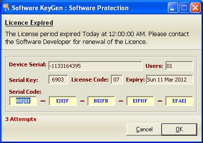

## VB6 Software Protection and Keygen

### Description

This is software “lock” module placed on Visual Basic 6.0 program by the developer to prevent the program from being copied or distributed without approval or authorization. The required Serial Code is different for every computer that the program runs in. The Serial Code has five sets of codes with each set having 5 characters i.e. ABCDE-FGHIJ-KLMNO-PQRST-UVWXY.

Also packaged is its Keygen and a Readme file that will help you understand the coding. Enjoy!!! Don't forget to vote for this Code.
 
### More Info
 

             |
---                |---
**Submitted On**   |2012-03-17 08:07:02
**By**             |[Maselv](https://github.com/Planet-Source-Code/PSCIndex/blob/master/ByAuthor/maselv.md)
**Level**          |Advanced
**User Rating**    |4.5 (27 globes from 6 users)
**Compatibility**  |VB 6\.0, VB Script, VBA MS Access, VBA MS Excel
**Category**       |[Complete Applications](https://github.com/Planet-Source-Code/PSCIndex/blob/master/ByCategory/complete-applications__1-27.md)
**World**          |[Visual Basic](https://github.com/Planet-Source-Code/PSCIndex/blob/master/ByWorld/visual-basic.md)
**Archive File**   |[VB6\_Softwa2221763192012\.zip](https://github.com/Planet-Source-Code/maselv-vb6-software-protection-and-keygen__1-74310/archive/master.zip)

